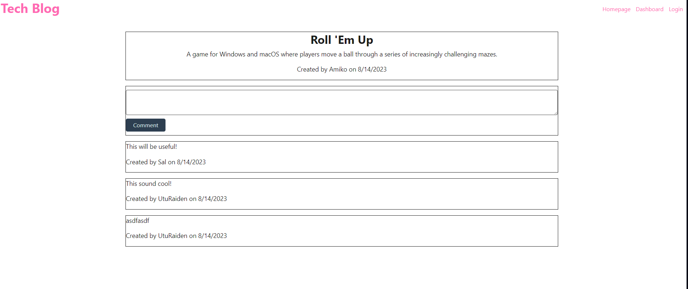

# Tech Blog

  
  ## Table of contents

  [Description](#Description)

  [Installation](#Installation)

  [Usage](#Usage)

  [Contribution](#Contribution)
  
  [Tests](#Tests)

  [License](#License)

  [Questions](#Questions)

  ## Description 

  It is a blogging site for users to share their thoughts on tech topics.

  ## Installation 

  Clone the repository and run npm i.

  ## Usage 

  This app will allow you to edit/ delete posts so dont worry about typos.

  ## Contribution 

  No guidelines

  ## Tests  

  After installing copy the text from the schemain the db folder. In a mysql terminal past the code you copied. Then in a new terminal type npm run seed after that type npm run start and the website will start at localhost:3001

  ## License 

  N/A

  ## Questions 

  I am on github at [UtuRaiden](https://github.com/UtuRaiden)

  Or my email is barronpeterson56@gmail.com

  ## Screenshots 

  

  
